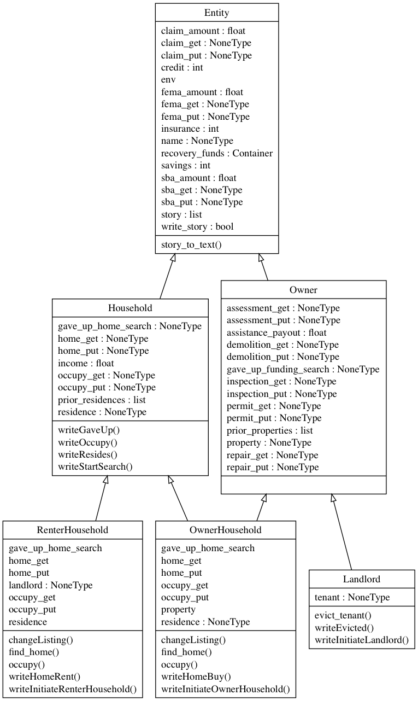
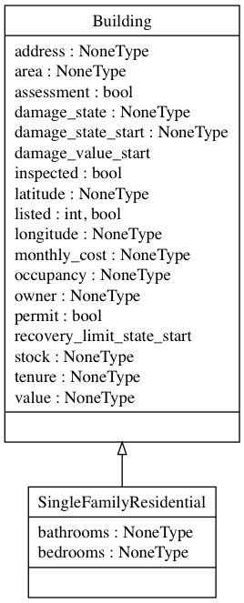
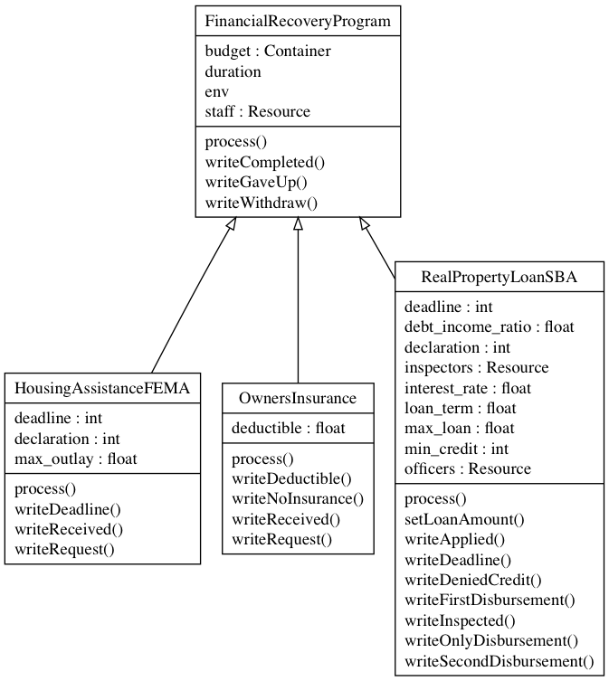
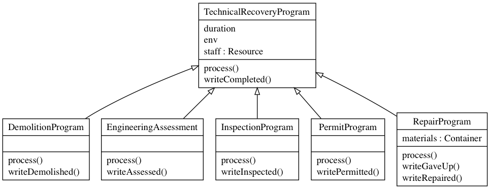
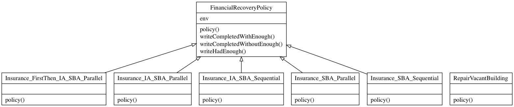

# DESaster Modules

`entities.py` **Module of classes for implementing DESaster entities, such as households and businesses.**



```
class Entity(object):
    """A base class for representing entities, such as households, businesses,
    agencies, NGOs, etc.

    __init__(self, env, name, write_story = False)    
    """

class Owner(Entity):
    """An class that inherits from the Entity() class to represent any entity
    that owns property.  An owner does not necessarily have a residence (e.g.,
    landlord). For the most part this is class is to define subclasses with Owner()
    attributes.

    __init__(self, env, name, attributes_df, building_stock, write_story = False)
    """

class Household(Entity):
    """Define a Household() class to represent a group of persons that reside
    together in a single dwelling unit. A Household() object can not own property,
    but does have a residence. For the most part this is class is to define
    subclasses with Household() attributes. Also includes methods for writing
    household stories.

    __init__(self, env, name = None, savings = 0, insurance = 0, credit = 0, write_story = False)
    """

class OwnerHousehold(Owner, Household):
    """The OwnerHousehold() class has attributes of both entities.Owner() and
    entities.Household() classes. It can own property and has a residence, which
    do not have to be the same. The OwnerHousehold() class includes methods to
    look for a new home to purchase (property), as well as to occupy a residence
    (not necessarily it's property). Also includes methods to write stories.

    __init__(self, env, name = None, income = float('inf'), savings = float('inf'),
                  insurance = 1.0, credit = 850, real_property = None, write_story = False)
    """

class RenterHousehold(Household):
    """The RenterHousehold() class has attributes of both entities.Entity() and
    entities.Household() classes. The class does not have associated property, but
    does have an associated landlord (entities.Landlord() object) that owns their
    residence. So RenterHousehold() objects can have both residences and landlords
    assigned and unassigned to represent, e.g., evictions.

    __init__(self, env, name = None, income = float('inf'), savings = float('inf'), insurance = 1.0, credit = 850, residence = None, landlord = None, write_story = False)
    """

class Landlord(Owner):
    """A Landlord() class is a subclass of entiites.Owner() but has an attributes
    that allows it to have a tenant (e.g., entities.RenterHousehold). Otherwise,
    similar to entities.Owner().

    __init__(self, env, name = None, savings = 0, insurance = 0, credit = 0, real_property = None,
                tenant = None, write_story = False):
    """

```

`structures.py` **Module of classes that represent different types of buildings used by DESaster entities.**



```
class Building(object):
    """Top-level class for representing attributes and methods of different types
    of buildings. Currently the possible damage states of the building must
    match the same possible damage states of buildings in HAZUS. A lookup table
    from HAZUS is then used to assign the associated damage value for the particular
    occupancy type.

    __init__(self, owner = None, occupancy = None, tenure = None, address = None, longitude = None,
                    latitude = None, value = None, cost = None, area = None,
                    listed = False, damage_state = None, building_stock = None):
    """

class SingleFamilyResidential(Building):
    """Define class that inherits from Building() for representing the
    attributes and methods associated with a single family residence. Currently
    just adds attribuees of bedrooms and bathroom and verifies a HAZUS-compatible
    residential building type is specified.

    __init__(self, owner = None, occupancy = None, tenure = None, address = None, longitude = None,
                    latitude = None, value = None, cost = None, area = None,
                    bedrooms = None, bathrooms = None, listed = False, damage_state = None,
                    building_stock = None):
    """
```

`financial.py` **Module of classes for implementing DESaster financial recovery programs.**



```
class FinancialRecoveryProgram(object):
    """The base class for operationalizing financial recovery programs.
    All such programs staff and budget implemented as simpy resources or containers.

    All other classes of financial recovery programs should inherit from this class,
    either directly or indirectly. The process for FinancialRecoveryProgram is
    useless and should only be used as an example of how to implement a process in a
    subclass of  FinancialRecoveryProgram.

    __init__(self, env, duration, staff=float('inf'), budget=float('inf')):
    """

class HousingAssistanceFEMA(FinancialRecoveryProgram):
    """A class for operationalizing FEMA's individual assistance grant program
    (for real property damage aspects only).

    __init__(self, env, duration, staff=float('inf'), budget=float('inf'),
                max_outlay=float('inf'), declaration=0, deadline=540):
    """

class OwnersInsurance(FinancialRecoveryProgram):
    """A class to represent an insurance company's hazard insurance program.
    The class process enforces a deductible to determine how much, if any, the
    insurance claim payout will be.

    __init__(self, env, duration, staff=float('inf'), budget=float('inf'),
                deductible=0.0):
    """

class RealPropertyLoanSBA(FinancialRecoveryProgram):
    """A class to represent an SBA real property loan program.

    __init__(self, env, duration, inspectors=float('inf'),
                officers=float('inf'), budget = float('inf'), max_loan = float('inf'),
                min_credit = 0, debt_income_ratio = 0.2, loan_term = 30.0,
                interest_rate = 0.04, declaration = 0, deadline = 60):
    """
```

`technical.py` **Module of classes for implementing DESaster technical recovery programs.**



```
class TechnicalRecoveryProgram(object):
    """The base class for operationalizing technical recovery programs.
    All such programs staff implemented as simpy resources .

    All other classes of technical recovery programs should inherit from this class,
    either directly or indirectly. The process for TechnicalRecoveryProgram is
    useless and should only be used as an example of how to implement a process in a
    subclass of TechnicalRecoveryProgram.

    __init__(self, env, duration, staff=float('inf')):
    """

class InspectionProgram(TechnicalRecoveryProgram):
    """ A class for representing staff allocation and process duration associated
    with post-event building inspections or tagging. No actual damage
    assessment (valuation) is done by the class process. It is done in the
    instantiation of the building object (e.g., entities.SingleFamilyResidential.damage_value)
    based on inputted damage_state and HAZUS lookup tables.

    __init__(self, env, duration, staff=float('inf')):
    """

class EngineeringAssessment(TechnicalRecoveryProgram):
    """A class to represent staff allocation and process duration associated with
    building engineering assessments. Conceptually this intended as a detailed
    damage assessment prior to design, permitting, and repair/construction of
    a building. No actual damage valuation is done by the class process, though
    it would conceputally make sense. It is done in the instantiation of the
    building object (e.g., entities.SingleFamilyResidential.damage_value)
    based on inputted damage_state and HAZUS lookup tables.

    __init__(self, env, duration, staff=float('inf'), ):
    """

class PermitProgram(TechnicalRecoveryProgram):
    """A class to represent staff allocation and process duration associated with
    building permit processing. Conceptually this intended prior to building
    repairs or construction.

    __init__(self, env, duration, staff=float('inf'), ):
    """

class RepairProgram(TechnicalRecoveryProgram):
    """A class to represent staff allocation and process duration associated with
    building repair. The class also represents building/concstruction materials in
    a simplified way--a single simpy.Container representing the inventory dollar
    value of undifferented materials

    *** Currently building materials are undifferentiad. Potentially eventually can
    represent different material types with separate simpy Containers (e.g.,
    wood, metal, aggregate, etc.)***

    __init__(self, env, duration, staff=float('inf'), materials=float('inf')):
    """

class DemolitionProgram(TechnicalRecoveryProgram):
    """A class to represent staff allocation and process duration associated with
    building demolition.

    __init__(self, env, duration, staff=float('inf')):
    """

```

`policies.py` **Module of classes that implement compound policies for custom arrangements of DESaster recovery programs.**



```
class FinancialRecoveryPolicy(object):
    """Base class for creating financial recovery policies. Serves to make
    pretty UML diagrams using pyreverse. And contains some story writing methods.

    __init__(self, env):
    """

class Insurance_IA_SBA_Sequential(FinancialRecoveryPolicy):
    """ A class that organizes funding requests to insurance, FEMA, and SBA in
    sequential order. Also implements patience for waiting for funding.

    __init__(self, env):
    """

class Insurance_IA_SBA_Parallel(FinancialRecoveryPolicy):
    """ A class that organizes funding requests to insurance, FEMA, and SBA in
    parallel. Also implements patience for waiting for funding.

    __init__(self, env):
    """

class Insurance_SBA_Sequential(FinancialRecoveryPolicy):
    """ A class that organizes funding requests to insurance and SBA in
    sequential order. Also implements patience for waiting for funding.

    __init__(self, env):
    """

class Insurance_FirstThen_IA_SBA_Parallel(FinancialRecoveryPolicy):
    """ A class that organizes funding requests to insurance, FEMA, and SBA.
    FEMA and SBA programs run in parallel but only *after* insurance claim has
    been processed (if has insurance).
    Also implements patience for waiting for funding.

    __init__(self, env):
    """

class Insurance_SBA_Parallel(FinancialRecoveryPolicy):
    """ A class that organizes funding requests to insurance and SBA in
    parallel. Also implements patience for waiting for funding.

    __init__(self, env):
    """

class RepairVacantBuilding(object):
    """ A class to represent a large-scale/bulk policy for expedited repairing
    of a building stock. Conceptually this is intended to repair vacant building
    stocks that do not have entities associated with them to repair them. This bulk
    repairing potentially provides additional homes for entities to purchase or rent.

    __init__(self, env):
    """
```

`io.py` **Module of functions for input/output related to DESaster.**

`hazus.py` **Module of functions and variable declarations for importing Hazus fragility curves and other related parameters.**

`visualize.py` **Module for creating static and interactive visualization of DESaster inputs and outputs.**
